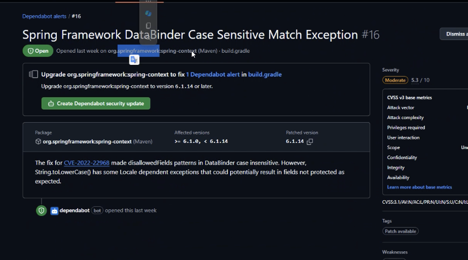
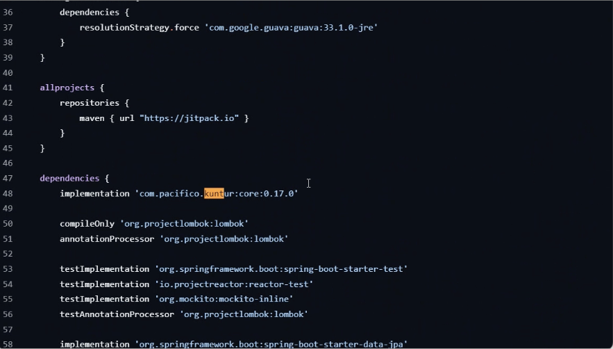

# test-pacifico-gradle-depenency

# Dependencia com.pacifico.kuntur:core y Gestión de Vulnerabilidades con Dependabot

Problema de visualización de vulnerabilidades en la dependencia `com.pacifico.kuntur:core:0.17.0` usando Dependabot en un entorno privado.

## Descripción del Problema

Pacífico está utilizando la dependencia `com.pacifico.kuntur:core:0.17.0`, y actualmente no es posible visualizar información de vulnerabilidades para esta dependencia en GitHub Dependabot debido a su configuración de repositorio. Esto se debe a que Dependabot requiere que las dependencias estén en repositorios públicos o en repositorios privados compatibles que permitan acceso a datos de vulnerabilidad.

A continuación, se muestran las capturas de pantalla de los mensajes de Dependabot y la configuración de la dependencia en el archivo `build.gradle`:

### Captura de Dependabot


En la imagen anterior, se observa una alerta de Dependabot que indica que no puede acceder a la información de vulnerabilidades para `com.pacifico.kuntur:core:0.17.0`.

### Configuración de `build.gradle`


En el archivo `build.gradle`, se encuentra la configuración de la dependencia en la línea 46:

```groovy
dependencies {
    implementation 'com.pacifico.kuntur:core:0.17.0'
    // Otras dependencias
}
```


## APP Prueba(example)

Este es un proyecto de ejemplo en Maven que se utiliza para probar la acción `maven-dependency-submission-action` en GitHub Actions.

## Cómo Ejecutar

Para ejecutar este proyecto localmente, asegúrate de tener Maven instalado y ejecuta:

```bash
mvn clean install
```
